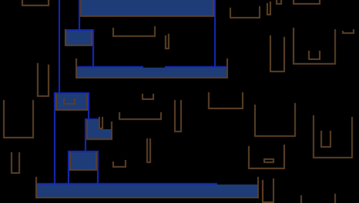
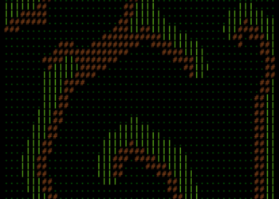

# Advent of Code 2018 - Solutions

Nim based solutions for the Advent of Code 2018

By [clj](https://github.com/clj). The https://clj.github.io/aoc-2018/ website contains
visualisations of the solutions to various days.

## Requirements

Nim >= 0.19.0; though for some things require the current (March 2019) development snapshot.

## Compiling

`nim c <solution_name.nim>`

or

`nim c -d:release <solution_name.nim>`

## Running

with a compiled program:

`solution_name < ..inputs/??/{input,test_input_01,...}`

or

`nim c -r SOLUTION_NAME.nim < ..inputs/??/input`

A few programs have command line options, see the source.